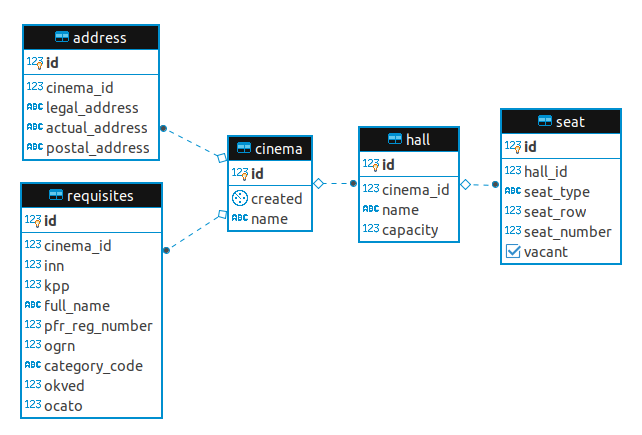

## Сервис для бронирования мест в кинотеатрах

### Системные требования

1. **ОС Linux**
1. **docker 19.03.6** или выше
1. **docker compose 1.23.1** или выше
1. **Java 8** и выше
1. **PostgreSQL 9.6** 

### Требования к компоненту

Требования к компоненту находятся в документе [Requirements](https://github.com/Petrovvich/test-task/blob/master/docs/Requirements.md).

### API

Компонент предоставляет следуюшие методы API:

##### Получение списка мест в зале
```http request
GET http://{server.host}/seats/{hallId}
```
Где, `hallId` - идентификатор зала

Пример успешного ответа
```json
{
  "status": "SUCCESS",
  "message": "Found",
  "data": [
    {
      "id": 1,
      "type": "SIMPLE",
      "row": 1,
      "number": 1,
      "vacant": true
    },
    {
      "id": 2,
      "type": "SIMPLE",
      "row": 1,
      "number": 2,
      "vacant": true
    }
  ]
}
``` 
Пример ответа в случае когда ничего не найдено
```json
{
  "status": "ERROR",
  "message": "Nothing found for hall with id 2"
}
```

##### Резервирование одного или нескольких мест
```http request
PUT http://{server.host}/seats/reserve/{reserve}
```
Где, `reserve` - флаг, показывающий на признак резервирования или снятия брони.

В теле запроса передается списком идентификаторы посадочных мест для бронирования

Пример тела запроса:
```json
   [236, 234, 233]
```
Пример успешного ответа
```json
{
    "status": "SUCCESS",
    "message": "Reserved",
    "data": {
        "236": true,
        "234": true
    }
}
```
Пример ответа в случае когда не удалось забронировать места
```json
{
    "status": "SUCCESS",
    "message": "Reserved",
    "data": {
        "30000": false
    }
}
```
В поле `data`, расположена информация о результате бронирования для каждого из переданных мест, 
если результат отличается от true, то место не получилось забронировать

В модуль интегрирован `swagger-ui` и после разворачивания модуля с документацией можно ознакомиться 
по url:
```
http://{server.host}/swagger-ui/
```  

### Реляционная модель



##### Таблица **cinema** - представление зала кинотеатра

- **id** - первичный ключ
- **created** - дата создания записи в бд
- **name** - название кинотеатра

##### Таблица **hall** - представление зала кинотеатра

- **id** - первичный ключ
- **cinema_id** - внешний ключ на тыблицу **cinema**
- **name** - название зала
- **capacity** - вместимость зала

##### Таблица **seat** - представление посадочного места

- **id** - первичный ключ
- **hall_id** - внешний ключ на тыблицу **hall**
- **seat_type** - тип посадочного места (SIMPLE - обычное место, VIP - для vip гостей)
- **seat_row** - номер ряда посадочного места
- **seat_number** -  номер посадочного места в ряде

##### Таблица **address** - представление адресов кинотеатра

- **id** - первичный ключ
- **cinema_id** - внешний ключ на тыблицу **cinema**
- **legal_address** - юридический адрес кинотеатра
- **actual_address** - фактический адрес кинотеатра 
- **postal_address** - почтовый адрес кинотеатра 

##### Таблица **requisites** - представление реквизитов (не платежных) юридического лица владеющего кинотеатром

- **id** - первичный ключ
- **cinema_id** - внешний ключ на тыблицу **cinema**
- **inn** - ИНН юридического лица
- **kpp** - КПП юридического лица
- **full_name** - полное наименование юридического лица
- **pfr_reg_number** - регистрационный номер в ПФР (как работодателя) юридического лица
- **ogrn** - ОГРН юридического лица
- **category_code** - код категории
- **okved** - ОКВЭД юридического лица
- **ocato** - ОКАТО юридического лица

### Инструкция по запуску

Для запуска приложения необходимо развернуть базу данных `PostgresSQL`.

В проекте в директории `/automation/db/` присутствует конфигурация докер образа для запуска 
docker-контейнера на базе образа `postgres:9.6-alpine` с помощью docker-compose.

Команда для старта базы данных в docker-контейнере (выполнять в корне проекта):
```shell script
docker-compose -f module-docker-compose.yml up -d --build --remove-orphans cinema-db
```

Для работы бд к контейнеру смонтирован `volume` на хост рабочей станции в директорию `/opt/cinema-db/`

Приложение можно запустить с помощью команды:
```shell script
docker-compose -f module-docker-compose.yml up -d --build --remove-orphans cinema-app
```
